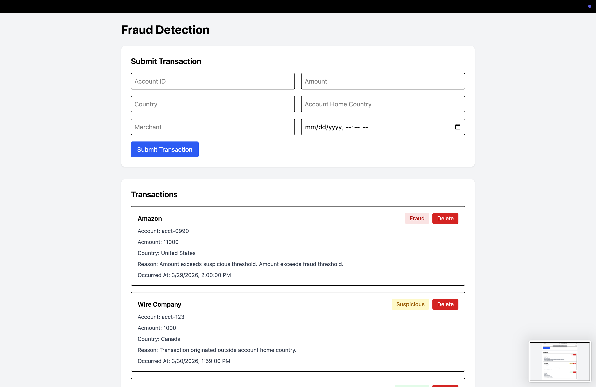
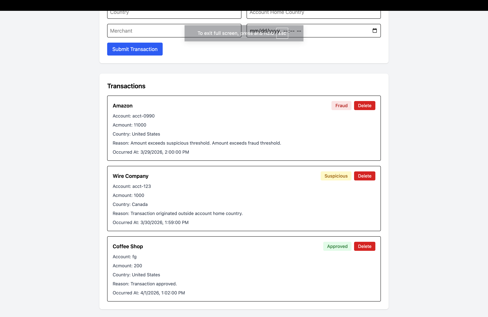

# Fraud Detection API & UI

A full-stack application that simulates a fraud detection system by analyzing financial transactions and applying rule-based decision logic.

## 🚀 Features

- Submit transactions
- Fraud decision logic (Approved, Suspicious, Fraud)
- Reason explanations
- View transaction history
- Delete transactions

## 🏗️ Tech Stack

### Backend

- C#
- ASP.NET Core
- Entity Framework Core
- SQL Server

### Frontend

- React
- TypeScript
- Tailwind CSS

## Screenshots

- 
- 

## ⚙️ Setup and Run

### 1. Prerequisites

- .NET SDK 10
- Node.js and npm
- SQL Server (local or remote)

### 2. Clone Repository

```bash
git clone https://github.com/jellis777/Fraud-Detection.git
cd FraudDetectionAPI
```

### 3. Backend Setup (Dependencies + Secrets + Database)

```bash
cd FraudDetectionApi
dotnet restore
dotnet user-secrets init
dotnet user-secrets set "ConnectionStrings:DefaultConnection" "Server=localhost,1433;Database=ClaimDb;User Id=YOUR_SQL_USER;Password=YOUR_SQL_PASSWORD;TrustServerCertificate=True;"
dotnet ef database update
dotnet run
```

Notes:

- Use your own SQL credentials. Do not commit real credentials to git.
- A safe template is available at `FraudDetectionApi/appsettings.Example.json`.

### 4. Frontend Setup

Open a second terminal from repo root:

```bash
cd fraud-detection-ui
npm install
npm run dev
```

### 5. Optional Tests

From repo root:

```bash
dotnet test
```

From `fraud-detection-ui`:

```bash
npm run test -- --run
```

## 🔌 API Endpoints

- GET /api/transactions
- GET /api/transactions/{id}
- POST /api/transactions
- DELETE /api/transactions/{id}

## 🧪 Example Request

```json
{
  "accountId": "ACC123",
  "amount": 1200,
  "country": "US",
  "accountHomeCountry": "US",
  "merchant": "Amazon",
  "occurredAt": "2026-03-31T12:00:00"
}
```

## 📊 Example Response

```json
{
  "id": 1,
  "accountId": "ACC123",
  "amount": 1200,
  "country": "US",
  "merchant": "Amazon",
  "occurredAt": "2026-03-31T12:00:00",
  "decision": "Fraud",
  "reason": "Transaction amount exceeds threshold"
}
```

## 💡 What This Demonstrates

- REST API design
- Layered backend architecture
- DTO usage
- Full-stack integration
- React state & forms
- Error handling

## 🔮 Future Improvements

- Authentication (JWT)
- Filtering & pagination
- Background processing
- ML-based fraud scoring

## 👤 Author

Jeff Ellis  
Full-Stack Software Engineer
